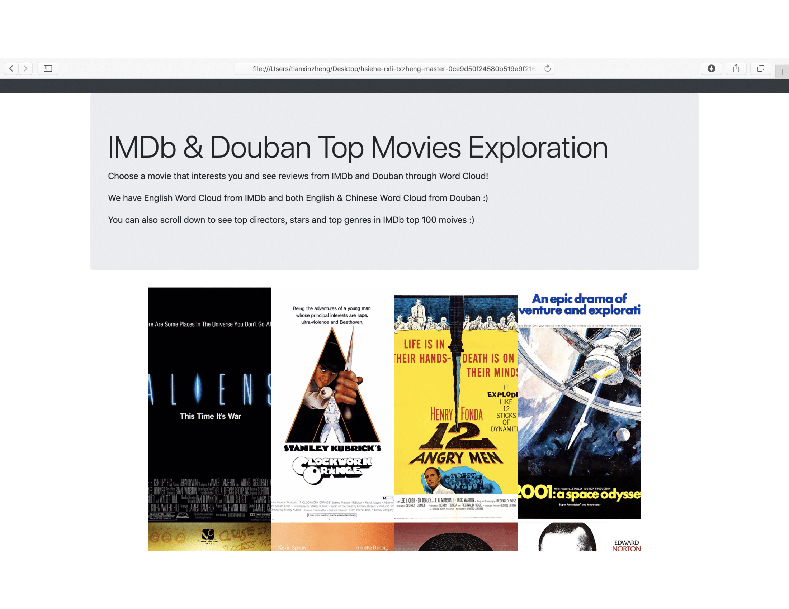
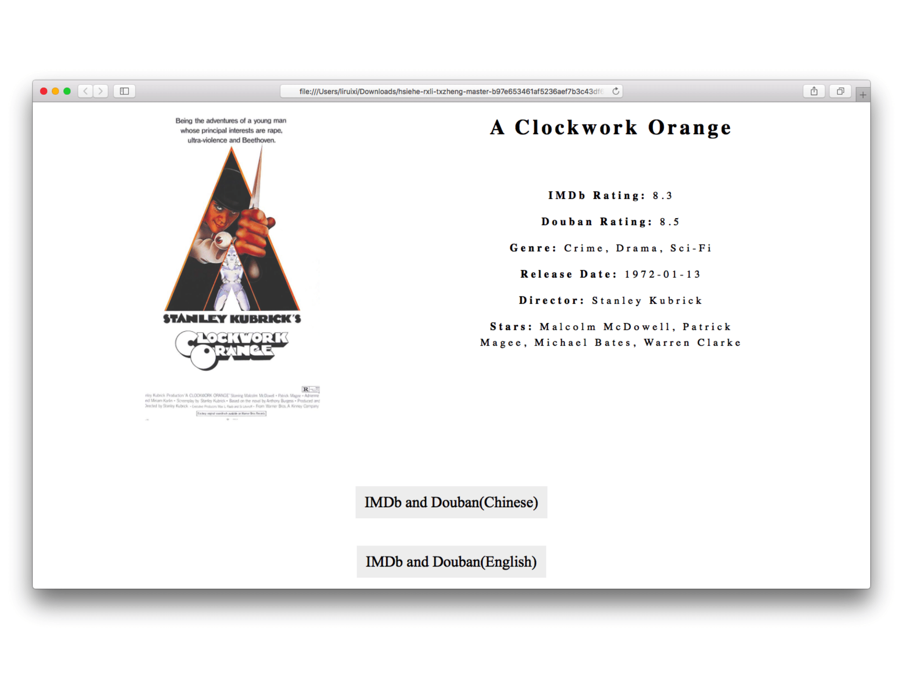
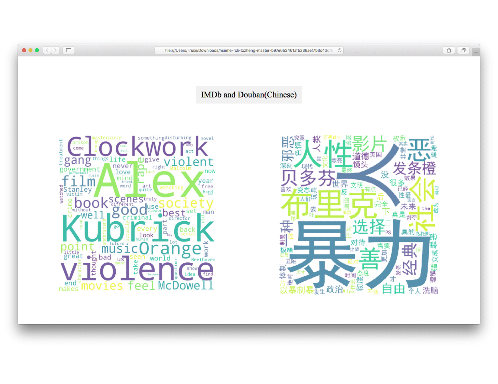
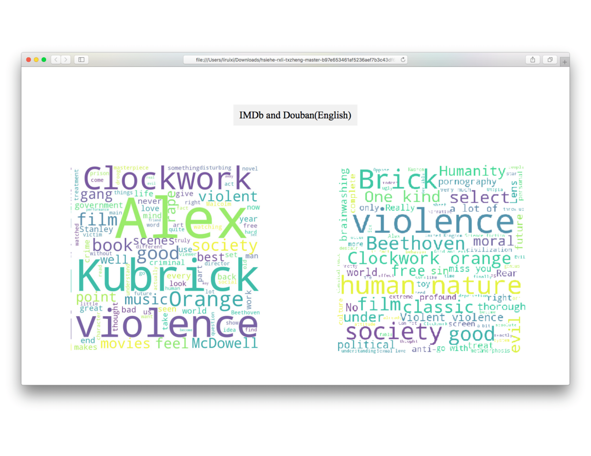

# IMDb and Douban Top Movies Exploration

The aim of this project is to compare the movie taste of Americans and Chinese. The taste here is identified using the movie reviews on IMDb and Douban(Chinese IMDb).

## Instructions

The main folder for submission in our Gitlab is the [code_and_data](https://mit.cs.uchicago.edu/capp30122-win-19/hsiehe-rxli-txzheng/tree/master/project/code_and_data) folder. We may use documents in other folders for demo.

### Steps to run our code

1. Install googletrans, jieba, wordcloud, urllib, Selenium, geckodriver packages.
2. Change directory to the code_and_data folder.
3. fireup the ipython3.
4. import go (import go may cost a lot of time! Please be patient and grab a piazza!)
5. Search any top250 movie with the below code. Three arguments are: movie_name(String), if_translate(boolean), exe_xpath(the xpath for Selenium in your local computer).
6. Then the douban graph will pop out!
7. Close the douban graph, then we will visited the IMDb website and finally the imdb graph will pop out! (Please don't interrupt the selenium when it go over the IMDb website.)

Code for step 5:

If you want to see IMDb wordcloud and Douban wordcloud (Chinese), run following code in ipython3: 

```python
[1] go(movie_name, False, exe_xpath)
```

If you want to see IMDb wordcloud and Douban wordcloud (English), run following code in ipython3: 

```python
[1] go(movie_name, True, exe_xpath)
```

Note:  Googletrans API may block the user if too much translations are made in a short time.


### Demo

We built a demo with summary graphs and 8 movies. You can open the main_page.html file in the demo_display folder directly to see our demo of mainpage!
Here is a screenshot of our mainpage:


You can open the any movie html file in the demo_display folder directly to see our demo for movie!
Here is a screenshot of our moviepage:




## Working Process

#### Step 1 ([imdb_crawler.py](https://mit.cs.uchicago.edu/capp30122-win-19/hsiehe-rxli-txzheng/tree/master/project/code_and_data/imdb_crawler.py),[douban_crawler.py](https://mit.cs.uchicago.edu/capp30122-win-19/hsiehe-rxli-txzheng/tree/master/project/code_and_data/douban_crawler.py))

We chose IMDb Top 100 movies and scraped posters, basic informations and 120 reviews for these movies into CSV format from https://www.imdb.com/ and https://www.douban.com/. 

#### Step 2 ([imdb_wordcloud.py](https://mit.cs.uchicago.edu/capp30122-win-19/hsiehe-rxli-txzheng/tree/master/project/code_and_data/imdb_wordcloud.py), [douban_wordcloud.py](https://mit.cs.uchicago.edu/capp30122-win-19/hsiehe-rxli-txzheng/tree/master/project/code_and_data/douban_wordcloud.py))

* For IMDb reviews, we generated the word cloud using wordcloud package. We added some stopwords, such as 'flim', 'movie'. (imdb_wordcloud.py)

* For douban reviews, firslty we used jieba package to cut the sentence into words. After cleaning words using Chinesestopwords.txt, we extract ed100 words with the highest occurency.
    1. For Chinese wordcloud of douban reviews, we directly constructed a dictionary which maps the word to frequency. Then we used generate_by_frequencies method in wordcloud to generate the Douban word cloud(Chinese).
    2. For English wordcloud of douban reviews, we translated the words and filtered by english_stopwords, then we constructed a dictionary which maps the word to frequency. Finally we use generate_by_frequencies method in wordcloud to generate the Douban word cloud(English).

#### Step 3 ([generate_movie_attributes.py](https://mit.cs.uchicago.edu/capp30122-win-19/hsiehe-rxli-txzheng/tree/master/project/code_and_data/generate_movie_attributes.py))

We conducted a summary analysis on the top 100 movies by plotting graphs, including top10 directors, top10 stars and top10 genres in movie_attributes folder.

#### step 4 ([demo_display](https://mit.cs.uchicago.edu/capp30122-win-19/hsiehe-rxli-txzheng/tree/master/project/demo_display) folder)

We created our demo to visualize our analysis results on an interactive web front-end .

## Code writing by member

- Ellen Hsieh: working on designing web scraping on IMDb for movie infromation, user reviews and movie images, grabing all the imformation from IMDb website, compiling imdb_movie_info.csv, imdb_reviews.csv and the movie_img file, and helping Tianxin with working on building the website.

- Tianxin Zheng:  worked on generating word cloud from IMDb data and building the interactive web front-end to visualize the analysis results with HTML, CSS & JavaScript.

- Ruixi Li: (1) working on web scraping on Douban for movie rating and user reviews, compiling imdb_douban_movie_info.csv, douban_reviews.csv. (2) generating word clouds for douban movie reviews (English & Chinese), and storing in douban_word_cloud_image folder. (3) conducting the summary analysis on all top 100 movies. (4) helping Tianxin with working on building the website.


## Other sources that we have used:

1. For front-end implementation (demo_display folder), we used templet from menucool.com at http://www.menucool.com/ui/responsive-image-grid-with-hover-effect to create the hover effect for main_page.html. We also consulted w3School documentation, https://www.w3schools.com/w3css/4/w3.css.
2. The find_topk function was borrowed from CAPP30121-pa3-util.py. We added comments in the file.
3. Some official documentations that we have consulted:
   - Pandas: https://pandas.pydata.org/pandas-docs/stable/
   - Python3: https://docs.python.org/3/
   - Regular Expression: https://docs.python.org/3.4/library/re.html
   - Jieba: https://pypi.org/project/jieba/
   - googletrans: https://py-googletrans.readthedocs.io/en/latest/
   - wordcloud: https://amueller.github.io/word_cloud/
   - selenium: https://www.seleniumhq.org/docs/
   - geckodriver: https://github.com/mozilla/geckodriver/releases
   - urllib: https://docs.python.org/3/library/urllib.html 
   - HTML: https://www.w3schools.com/html/default.asp
   - CSS: https://www.w3schools.com/css/default.asp

